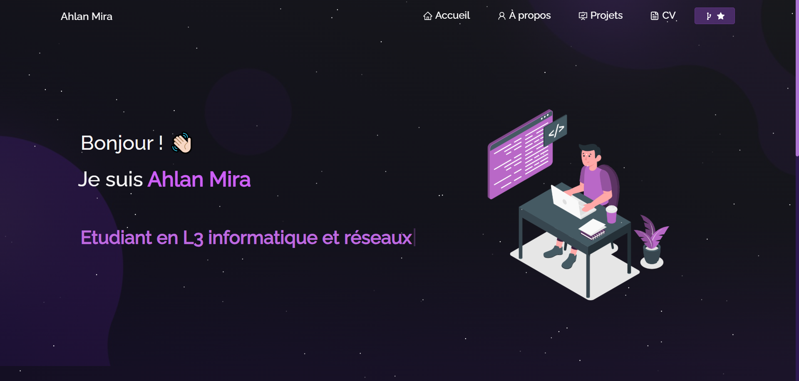

<h2 align="center">
  Developer Portfolio - Ahlan Mira  
  <a href="https://portfolio-46cd.vercel.app//" target="_blank">View Live Site</a>
</h2>

  

 

 &nbsp;
 &nbsp;
 &nbsp;
 &nbsp;

## 🚀 About

My **personal portfolio** built with React.js showcasing my technical skills, projects, and professional journey.

## Built With

This project was built using these technologies:

- React.js
- Node.js
- CSS3
- VsCode
- Vercel

## ✨ Features

- **📖 Multi-Page Layout** - Modern and clean design
- **🎨 Fully Responsive** - Adapts to all devices
- **⚡ Optimized Performance** - Built with React
- **🎯 Smooth Navigation** - Intuitive user experience
- **🔧 Easy to Customize** - Simple color and content customization

## Getting Started

Clone down this repository. You will need `node.js` and `git` installed globally on your machine.

## 🛠 Installation and Setup Instructions

1. Installation: `npm install`

2. In the project directory, you can run: `npm start`

Runs the app in the development mode.\
Open [http://localhost:3000](http://localhost:3000) to view it in the browser.
The page will reload if you make edits.

## Usage Instructions

Open the project folder and Navigate to `/src/components/`. 
You will find all the components used and you can edit your information accordingly.

## 🏗 Project Structure

Portfolio/
├── src/
│ ├── components/ # React components
│ ├── assets/ # Images and resources
│ └── styles/ # CSS stylesheets
├── public/ # Static files
└── package.json # Project configuration

**Ahlan Mira** - Passionate Developer

  Developed with ❤️ by Ahlan Mira

